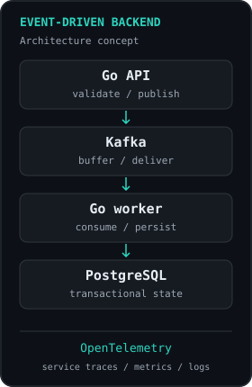

I build APIs, event-driven services, and data-intensive systems, with a focus on **correctness and observability**. My core is Go backend engineering; I also work across web and mobile when the product needs it.

[Portfolio](https://project-86len.vercel.app) · [LinkedIn](https://www.linkedin.com/in/jonathanfarrel/) · [Email](mailto:jonathanfarelemanuel@gmail.com)

### Engineering map

<table>
<tr>
<td width="68%" valign="top">
<pre>Jonathan
  │
  ├── CORE
  │    └── Go Backend Engineer
  │
  ├── DEPTH
  │    ├── Distributed Systems
  │    ├── Data / Kafka / PostgreSQL
  │    ├── Cloud / Kubernetes
  │    └── Observability
  │
  ├── BREADTH
  │    ├── React / TS / Next / SvelteKit
  │    └── Flutter
  │
  └── NEXT SPECIALIZATION
       ├── AI systems
       ├── Trading infrastructure
       ├── Web3 backends
       └── Rust / C++ systems</pre>
</td>
<td width="32%" valign="top" align="right">
<!-- To use your own visual, upload it to assets/ and replace this src.
     Keep width="240" and descriptive alt text. -->

</td>
</tr>
</table>

**Core** is my specialization. **Depth** strengthens it. **Breadth** extends my product work. **Next** marks the areas I am exploring.

### Selected projects

| Project | Focus |
| :--- | :--- |
| **[observe-system](https://github.com/Jonathan1366/observe-system)** · Go | Backend observability project, focused on understanding service behavior. |
| **[blockchain-money-transfer](https://github.com/Jonathan1366/blockchain-money-transfer)** · Go | Blockchain money-transfer project, exploring wallet and transfer workflows. |
| **[RevAuto](https://github.com/Jonathan1366/RevAuto)** · TypeScript / Next.js | Fleet operations frontend with a Mapbox/GPS driver cockpit. Fleet backend integration is planned. |

### Current focus

- **Backend depth:** strengthening service boundaries, reliable asynchronous processing, and observability.
- **Next exploration:** applying that foundation to AI systems, market-data pipelines, and Web3 backends.

<details>
<summary><b>Technology stack & scope</b></summary>

<br/>


**Primary focus:** Go, PostgreSQL, Kafka, Redis, APIs, and service observability.

**Supporting capabilities:** cloud and containers, TypeScript/React, and Flutter. Next.js and SvelteKit extend the web toolkit.

**Exploration:** AI and vector retrieval, trading infrastructure, Web3, Rust, and C++. This map includes tools I am developing through projects; experience varies across the stack.

</details>

<details>
<summary><b>How I build</b></summary>

- Start with clear boundaries, a reproducible setup, and a small system that can be operated.
- Keep transactional state in PostgreSQL; make retries and duplicate messages explicit design concerns.
- Introduce queues, caching, and additional services when the workload justifies them.
- Use logs, metrics, and traces to investigate failures and guide performance work.
- Document setup, tests, architectural decisions, and measured results in each project.

</details>

<details>
<summary><b>Engineering principles</b></summary>

```text
correctness        > cleverness
observability      > guessing
measured scaling   > premature complexity
failure handling   > happy-path demos
tests              > assumptions
ownership          > hand-offs
```

I value systems that remain understandable when a consumer lags, a transaction retries, or a dependency slows down.

</details>
