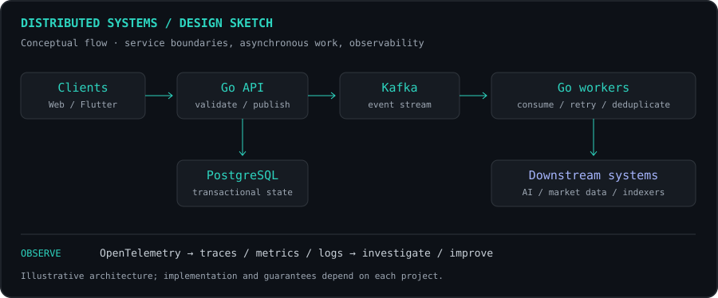

### Jonathan · Go Backend Engineer

My core is **Go backend engineering and distributed systems**: APIs, event-driven services, concurrency, and reliable data processing, with a focus on correctness and observability.

Alongside Go, I work across **TypeScript/React, Node.js, Python, and Flutter**, and I am building deeper skills in **Rust and C++** for performance-sensitive systems. AI, trading infrastructure, Web3, and real-time machine systems are areas of exploration.

[Portfolio](https://project-86len.vercel.app) · [LinkedIn](https://www.linkedin.com/in/jonathanfarrel/) · [Email](mailto:jonathanfarelemanuel@gmail.com)

**Core toolkit**

<a href="https://github.com/tandpfun/skill-icons"></a>

**Additional toolkit & exploration**

<a href="https://github.com/tandpfun/skill-icons"></a>

### Engineering map

<table>
<tr>
<td width="68%" valign="top">
<pre>Jonathan
  │
  ├── CORE
  │    └── Go Backend Engineer
  │
  ├── DEPTH
  │    ├── Distributed Systems
  │    ├── Data / Kafka / PostgreSQL
  │    ├── Cloud / Kubernetes
  │    └── Observability
  │
  ├── BREADTH
  │    ├── React / TS / Next / SvelteKit
  │    ├── Node.js / Python
  │    └── Flutter
  │
  └── NEXT SPECIALIZATION
       ├── AI systems
       ├── Trading infrastructure
       ├── Web3 backends
       ├── Rust / C++ systems
       └── Robotics / real-time control</pre>
</td>
<td width="32%" valign="top" align="right">
<!-- To use your own visual, upload it to assets/ and replace this src.
     Keep width="240" and descriptive alt text. -->

</td>
</tr>
</table>

**Core** is my specialization. **Depth** strengthens it. **Breadth** extends my product work. **Next** marks the areas I am exploring.

### Selected projects

| Project | Focus |
| :--- | :--- |
| **[observe-system](https://github.com/Jonathan1366/observe-system)** · Go | Backend observability project, focused on understanding service behavior. |
| **[blockchain-money-transfer](https://github.com/Jonathan1366/blockchain-money-transfer)** · Go | Blockchain money-transfer project, exploring wallet and transfer workflows. |
| **[RevAuto](https://github.com/Jonathan1366/RevAuto)** · TypeScript / Next.js | Fleet operations frontend with a Mapbox/GPS driver cockpit. Fleet backend integration is planned. |

### Project signals



<details>
<summary><b>Distributed system design sketch</b></summary>

<br/>



The API validates requests and publishes events. Workers handle asynchronous work. Retries, deduplication, transactional boundaries, and observability are explicit design concerns.

</details>

### Current focus

- **Backend depth:** strengthening service boundaries, reliable asynchronous processing, and observability.
- **Systems exploration:** Rust and C++ for concurrency, low-latency processing, and performance experiments.
- **Applied exploration:** AI agents/RAG, trading and market-data pipelines, Web3 indexers, and real-time machine systems.

<details>
<summary><b>Technology stack & scope</b></summary>

<br/>


**Primary focus:** Go, PostgreSQL, Kafka, Redis, APIs, and service observability.

**Platform and observability:** Docker, Kubernetes, AWS/GCP, Terraform, OpenTelemetry, Prometheus, and Grafana.

**Supporting capabilities:** TypeScript/React, Node.js, Python, and Flutter. Next.js, SvelteKit, NestJS, and Express extend the product toolkit.

**Systems exploration:** Rust and C++ — concurrency, memory and performance profiling, low-latency processing, and real-time control.

**Applied exploration:** AI agents, RAG, LLM applications, PyTorch/OpenCV and vector retrieval; market data and backtesting; Ethereum/Solana indexing and wallet/ledger systems; robotics and embedded systems.

The stack follows my [portfolio](https://project-86len.vercel.app). **Go remains the primary specialization**; the wider map includes supporting tools and project-based learning, with different levels of experience.

</details>

<details>
<summary><b>How I build</b></summary>

- Start with clear boundaries, a reproducible setup, and a small system that can be operated.
- Keep transactional state in PostgreSQL; make retries and duplicate messages explicit design concerns.
- Introduce queues, caching, and additional services when the workload justifies them.
- Use logs, metrics, and traces to investigate failures and guide performance work.
- Document setup, tests, architectural decisions, and measured results in each project.

</details>

<details>
<summary><b>Engineering principles</b></summary>

```text
correctness        > cleverness
observability      > guessing
measured scaling   > premature complexity
failure handling   > happy-path demos
tests              > assumptions
ownership          > hand-offs
```

I value systems that remain understandable when a consumer lags, a transaction retries, or a dependency slows down.

</details>

<!-- Visual references: https://github.com/abhisheknaiidu/awesome-github-profile-readme
     Icon component: https://github.com/tandpfun/skill-icons (hosted service).
     Terminal, diagrams and language bars are custom SVGs stored in assets/.
     Source data and snapshot date: assets/project-languages.json. -->
