**Go Backend Engineer** focused on **distributed systems, reliable APIs, and observability**. I build with Go, PostgreSQL, Kafka, Redis, and cloud infrastructure.

**Also:** TypeScript/React · Node.js · Python · Flutter · Rust · C++, AI systems, trading infrastructure, Web3, and real-time control.

[Portfolio](https://project-86len.vercel.app) · [LinkedIn](https://www.linkedin.com/in/jonathanfarrel/) · [Email](mailto:jonathanfarelemanuel@gmail.com)

### Selected work

| Project | Engineering focus |
| :--- | :--- |
| [**observe-system**](https://github.com/Jonathan1366/observe-system) | Go · service observability |
| [**blockchain-money-transfer**](https://github.com/Jonathan1366/blockchain-money-transfer) | Go · wallet and transfer workflows |
| [**RevAuto**](https://github.com/Jonathan1366/RevAuto) | Next.js/TypeScript · fleet frontend, Mapbox/GPS; backend planned |

<b>Toolkit & direction</b>

**Core / depth:** Go · distributed systems · PostgreSQL · Kafka · Redis · Docker/Kubernetes · cloud · OpenTelemetry.

**Product breadth:** TypeScript · React/Next.js/SvelteKit · Node.js · Python · Flutter.

**Systems exploration:** Rust/C++ · AI agents/RAG · market data · Web3 indexers · robotics/real-time control.

Correctness · measured performance · failure handling · observability · ownership.

