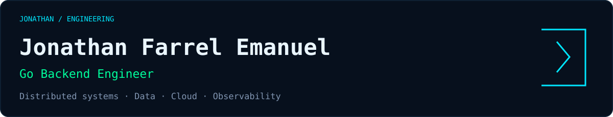
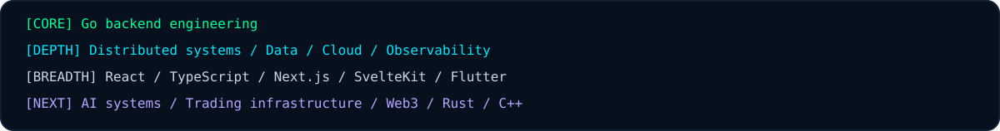
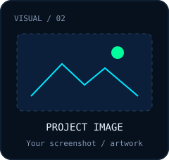
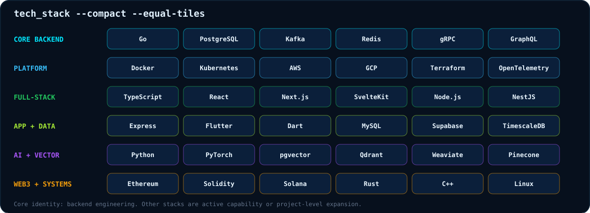
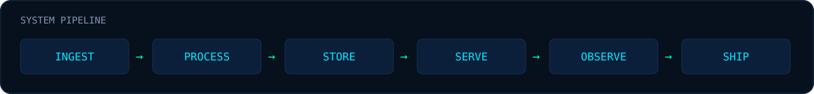

<div align="center">
  
</div>

<br/>

<div align="center">
  
</div>

<br/>

<div align="center">

**Go-first Backend Engineer** · fintech systems · AI agents · trading & Web3 infra

[Email](mailto:jonathanfarelemanuel@gmail.com)
&nbsp;·&nbsp;
[LinkedIn](https://www.linkedin.com/in/jonathanfarrel/)
&nbsp;·&nbsp;
[GitHub](https://github.com/Jonathan1366)

<br/>


</div>

---

### whoami

I'm Jonathan. I write backend systems, mostly in Go.

The work I actually spend time on is not the demo path. It's the part that has to stay correct after the service is live: APIs, data models, transactions, queues, retries, and the failure modes that show up when money, state, or other services are involved. I've been doing that in production for 3+ years, largely on fintech-shaped problems — payments, wallets, anything where a double write is not an acceptable bug.

Backend is the job. The rest of this profile is the same job on harder surfaces.

### engineering map

<table>
<tr>
<td width="68%" valign="top">
<pre>Jonathan
  │
  ├── CORE
  │    └── Go Backend Engineer
  │
  ├── DEPTH
  │    ├── Distributed Systems
  │    ├── Data / Kafka / PostgreSQL
  │    ├── Cloud / Kubernetes
  │    └── Observability
  │
  ├── BREADTH
  │    ├── React / TS / Next / SvelteKit
  │    └── Flutter
  │
  └── NEXT SPECIALIZATION
       ├── AI systems
       ├── Trading infrastructure
       ├── Web3 backends
       └── Rust / C++ systems</pre>
</td>
<td width="32%" valign="top" align="right">
<!-- RIGHT COLUMN: Upload your images to assets/, then replace the two src paths below.
     Keep width="240" and align="right" on this cell. PNG, JPG, GIF, and SVG can be used.
     These are placeholder illustrations, not project screenshots. -->

<br/><br/>

</td>
</tr>
</table>

**Core** is my engineering identity. **Depth** is where I strengthen it. **Breadth** lets me work across the product. **Next specialization** is the direction I am developing through projects.


I'm not switching careers into "AI" or "crypto." I want to take the backend work I already do — correctness, throughput, observability, failure handling — into those environments.

---

### what I can do

**Ship a backend that holds up.**
Go services over REST, gRPC, or GraphQL. Clear module boundaries. Tests. CI. The boring production stuff: timeouts, retries, idempotency keys, structured logs.

**Move money and state without guessing.**
PostgreSQL as the source of truth. Transaction boundaries. Double-entry thinking for ledgers. Audit trails. Redis where it earns its place (sessions, locks, hot reads) — not as a second database you pray stays in sync.

**Run work in the background.**
Kafka when a request should not wait on everything downstream. Consumers that can crash and restart without duplicating side effects. Backpressure instead of a queue that silently melts.

**Operate it.**
Docker and Kubernetes. AWS / GCP. Terraform when the infra needs to be repeatable. OpenTelemetry + Prometheus + Grafana so a stuck transaction is a trace, not a Slack thread.

**Own the product surface when I have to.**
TypeScript, React, Next.js, Flutter. I'm a backend engineer who can ship the rest of the product — not someone who throws JSON over a wall and disappears.

**AI, trading, Web3 — as systems, not stickers.**
Agents with tools, guardrails, and eval. RAG that starts on Postgres + pgvector and only moves to a dedicated vector DB if the workload needs it. Market data in, time-series store, backtests. Chain indexers that handle retries, confirmations, and reorgs. Same backend problems, different inputs.

```
[BOOT] jonathan-engine
[ OK ] identity ............. Go-first backend engineer
[ OK ] production ........... 3+ years, fintech-shaped systems
[ OK ] core ................. go · postgres · kafka · redis · k8s
[ OK ] next ................. AI agents · trading infra · web3 backends
[ OK ] mode ................. build → measure → scale when it hurts
```

---

### stack --all



Go backend engineering is the core. The wider stack includes supporting tools and areas of project-level exploration; it does not imply equal production experience in every technology.

---

### how I build

MVP first. Scale when it hurts.

I know the later versions of these stacks (CQRS, distributed SQL, service mesh, HSM). I also know most products die before they need them. The list below is a map, not a shopping list.

<details>
<summary><b>Frontend — from first app to something that can grow</b></summary>

- **MVP:** Flutter (one codebase → Android + iOS) or React for web. Ship.
- **Scale-up:** Flutter + Next.js (SSR) when onboarding pages have to load fast and be findable.
- **Enterprise:** micro-frontends + server-driven UI when the app-store release cycle is the bottleneck.
- **Later:** Wasm / edge-rendered UI if the product actually needs near-native in the browser.

</details>

<details>
<summary><b>Backend — the money brain</b></summary>

- **MVP:** one Go (or Node) service + REST. One repo. Two people can run it.
- **Scale-up:** modular monolith + GraphQL if the clients start over-fetching.
- **Enterprise:** services + gRPC + an API gateway + Kafka. Payday traffic is a queue problem, not a "just add instances" problem.
- **Later:** Rust on the hot path, CQRS / event sourcing when balances really do need to be computed from history.

</details>

<details>
<summary><b>Data — the vault</b></summary>

- **MVP:** one PostgreSQL. That's it.
- **Scale-up:** primary / replica + Redis for sessions, OTP, hot keys.
- **Enterprise:** Postgres still owns truth. Mongo or object storage for cold history. Elasticsearch if search has to feel instant.
- **Later:** distributed SQL, a graph store for fraud rings, an edge DB — only if the product is actually there.

</details>

<details>
<summary><b>Infra — the engine room</b></summary>

- **MVP:** PaaS. Push to git, go live.
- **Scale-up:** Docker + Cloud Run (or equivalent). Pay for what runs.
- **Enterprise:** Kubernetes + Terraform + a real CI/CD pipeline. Reproducible environments.
- **Later:** eBPF, service mesh, GitOps. Kernel-level networking is not a week-one task.

</details>

<details>
<summary><b>Security & observability — the guard tower</b></summary>

- **MVP:** secrets in a manager (not the repo), JWT, Sentry.
- **Scale-up:** Prometheus / Grafana. You should see a spike before a customer tweets it.
- **Enterprise:** Vault, distributed tracing, WAF. One stuck transfer should be a single trace, not four dashboards.
- **Later:** HSM, chaos drills, stronger crypto where the threat model actually asks for it.

</details>

<div align="center">
  
</div>

A pipeline is easy to draw. The job is making each stage still behave when a dependency slows down, a message arrives twice, a connection drops, or traffic spikes on payday.

---

### selected work

| Project | What it is |
| --- | --- |
| **[observe-system](https://github.com/Jonathan1366/observe-system)** · Go | Observability-shaped backend: health, traces, metrics, logs, the kind of service you open during an incident. |
| **[RevAuto](https://github.com/Jonathan1366/RevAuto)** · TypeScript | Fleet operations portal. Live Mapbox / GPS in the driver cockpit, role-based workflows, tests. Product engineering, not a toy dashboard. |
| **[blockchain-money-transfer](https://github.com/Jonathan1366/blockchain-money-transfer)** · Go | Wallet and transfer flows. Earlier work I keep around because the next version of this problem is a proper ledger: atomic transfers, idempotency, an audit trail. |
| **[VisionLab](https://github.com/Jonathan1366/VisionLab)** · Python | Applied computer vision: detection, inference, real-time processing. Useful because AI work I respect still has a model, a pipeline, and a failure mode. |

These are the public repos that already exist. The next ones below are the queue — named so I don't pretend they're done.

**Up next (being built, not pasted as if they already shipped):**

- `marketstream-go` — real-time market data. Go, Kafka, TimescaleDB, Redis, OpenTelemetry.
- `chain-indexer-go` — EVM / Solana indexing with retries, confirmations, reorg handling.
- `agentic-trading-lab` — research loop: Go backend, TypeScript UI, Python agents, backtests, paper trading.
- `wallet-ledger-go` — double-entry ledger, atomic transfers, idempotency, audit trail.
- `ai-model-lab` — training → eval → serving, with inference as an engineering problem.
- `systems-performance-lab` — Go / Rust / C++, order books, low-latency paths, benchmarks.

A flagship repo should have more than source: an architecture README, tests, CI, a way to run it locally, and a note on the trade-offs. That's the bar.

---

### principles

```
correctness        >  cleverness
observability      >  guessing
measured scaling   >  premature complexity
failure handling   >  happy-path demos
tests              >  assumptions
ownership          >  hand-offs
shipping           >  endless planning
```

I like systems that stay understandable when something goes wrong: a consumer lags, a transaction retries, an API times out, a database slows down, or an incident starts at an inconvenient hour.

---

<div align="center">

I build backend systems. Fintech, AI, trading, Web3 — same discipline.

[Email](mailto:jonathanfarelemanuel@gmail.com)
&nbsp;·&nbsp;
[LinkedIn](https://www.linkedin.com/in/jonathanfarrel/)

```
root@jonathan-engine:~$ shutdown --never
```


</div>
